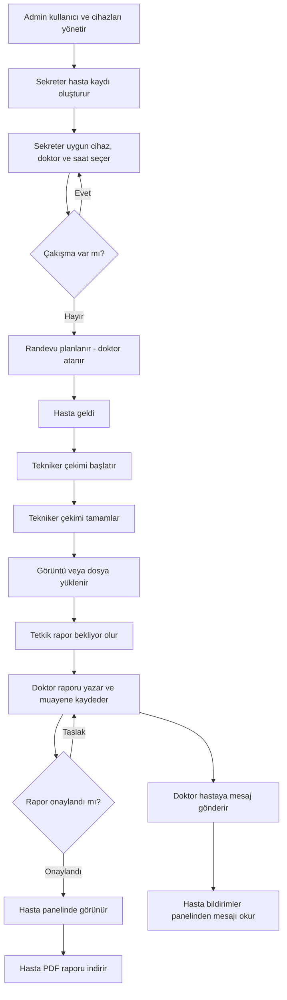
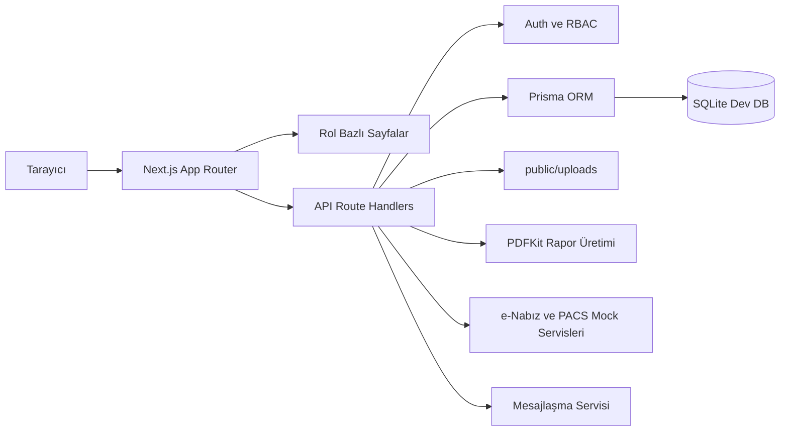
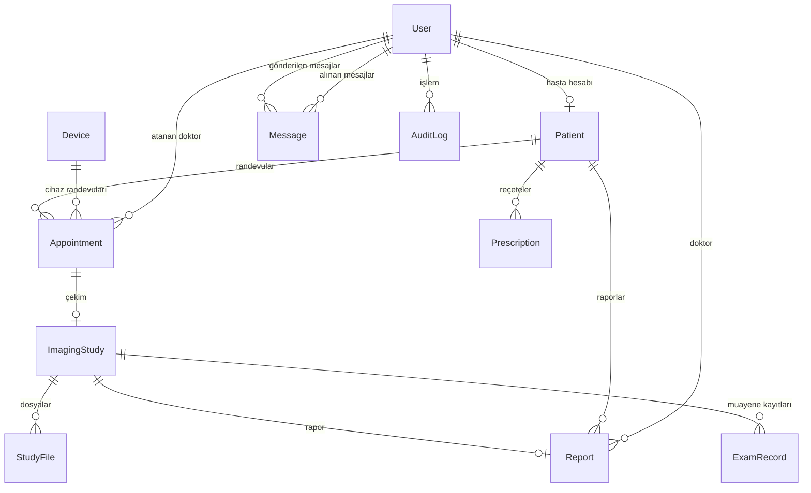

# Hastane Otomasyon Sistemi

Modern, rol bazlı ve web tabanlı bir **hastane otomasyon sistemi**. Randevu planlama, hasta yönetimi, çekim takibi, rapor yazımı, PDF rapor çıktısı, hasta sonuç portalı, doktor-hasta iletişimi ve yönetim panellerini tek merkezde toplar.

<p align="center">
  
  
  
  
  
</p>

## İçindekiler

- [Proje Özeti](#proje-özeti)
- [Görsel Kimlik](#görsel-kimlik)
- [Öne Çıkan Özellikler](#öne-çıkan-özellikler)
- [Roller ve Paneller](#roller-ve-paneller)
- [Uçtan Uca İş Akışı](#uçtan-uca-iş-akışı)
- [Mimari](#mimari)
- [Teknoloji Seti](#teknoloji-seti)
- [Kurulum](#kurulum)
- [Demo Kullanıcılar](#demo-kullanıcılar)
- [Komutlar](#komutlar)
- [API Özeti](#api-özeti)
- [Veritabanı](#veritabanı)
- [PDF Raporlama](#pdf-raporlama)
- [Güvenlik](#güvenlik)
- [Test](#test)
- [Klasör Yapısı](#klasör-yapısı)
- [Dokümantasyon](#dokümantasyon)
- [Varsayımlar](#varsayımlar)
- [Gelecek Geliştirmeler](#gelecek-geliştirmeler)

---

## Proje Özeti

Bu uygulama, hastanelerin radyoloji departmanında kullanılan röntgen, ultrason, MR ve tomografi süreçlerini dijitalleştirmek için geliştirilmiş tam kapsamlı bir sistemdir.

Sistem şu operasyonları destekler:

- Sekreter tarafından hasta kaydı ve randevu oluşturma; randevuya **doktor atanması**
- Cihaz/oda uygunluk takibi ve randevu çakışma kontrolü
- Tekniker tarafından çekim süreci yönetimi
- Görüntü veya demo dosya yükleme
- Radyolog tarafından rapor taslağı, onay ve revizyon akışı
- Hasta tarafından onaylı rapor görüntüleme ve PDF indirme
- **Doktor-hasta mesajlaşması:** Doktor, hastayla doğrudan mesajlaşabilir; hasta bildirimleri panelinden mesajları okuyabilir
- **Personel içi mesajlaşma:** Admin, sekreter, tekniker ve doktorlar birbirleriyle mesaj gönderebilir
- **Doktor hasta listesi:** Doktor, ilgilendiği hastaları ve reçeteleri tek ekranda görür
- Admin tarafından kullanıcı, cihaz, rapor, log ve istatistik yönetimi

---

## Görsel Kimlik

Uygulama genelinde **wine red**, **champagne**, **cream** ve **muted gold** renkleri kullanılır. Marka görseli sidebar ve PDF rapor başlığında kurumsal bir kimlik olarak entegre edilmiştir.

### Uygulama Ekran Görüntüleri

<p align="center">
  
</p>

<p align="center">
  
</p>

<p align="center">
  
</p>

Kullanılan ana renkler:

| Token | Renk |
| --- | --- |
| Wine Red | `#7B1E3A` |
| Dark Wine | `#4A0F24` |
| Champagne | `#F7E7CE` |
| Soft Champagne | `#FFF6E8` |
| Cream Background | `#FAF4EA` |
| Muted Gold | `#C8A96A` |

---

## Öne Çıkan Özellikler

- **Rol bazlı giriş ve yetkilendirme:** Admin, sekreter, tekniker, doktor ve hasta rolleri.
- **JWT cookie tabanlı oturum:** HTTP-only cookie ile güvenli oturum yönetimi.
- **RBAC koruması:** Sayfa ve API seviyesinde rol kontrolü.
- **Hasta yönetimi:** Hasta kayıt, arama, detay ve geçmiş bilgileri.
- **Randevu çizelgeleme:** Cihaz ve hasta çakışmasını engelleyen iş kuralları; randevuya doktor atama ve doktor müsaitlik kontrolü.
- **Doktor atama:** Sekreter randevu oluştururken `DoctorPicker` bileşeniyle uygun doktoru seçer; müsait olmayan doktorlar otomatik olarak işaretlenir.
- **Cihaz/oda yönetimi:** Aktif, bakımda ve pasif cihaz takibi.
- **Çekim süreci:** Hasta geldi → çekim başladı → çekim tamamlandı → rapor bekliyor akışı.
- **Dosya yükleme:** Demo PDF/JPG/PNG/DICOM simülasyon dosyası bağlama.
- **Raporlama:** Taslak, onay, revizyon ve onaylı rapor akışı.
- **PDF rapor:** Backend tarafından resmi görünümlü PDF üretimi.
- **Hasta portalı:** Hasta yalnızca kendi onaylı raporlarını, tetkiklerini ve reçetelerini görür.
- **Dijital reçete:** Doktor ilaç listesi ve talimatlarla reçete oluşturur; hasta PDF olarak indirebilir.
- **Muayene kaydı ve tanı yönetimi:** Doktor, tetkik detay sayfasından şikayet ve tanı kaydeder; hasta muayene geçmişini kendi panelinden takip eder.
- **Doktor-hasta mesajlaşması:** Doktor, hasta listesinden seçtiği hastaya doğrudan mesaj gönderebilir. Hasta, `Bildirimler` sayfasından bu mesajları okur.
- **Personel içi mesajlaşma:** Admin, sekreter, tekniker ve doktorlar `/messages` sayfasında gerçek zamanlı mesajlaşabilir.
- **Doktor hasta listesi:** Doktor, raporladığı veya muayene ettiği hastaları tek ekranda görür; reçetelere hızlıca erişir.
- **Gerçek zamanlı bildirim sistemi:** Rapor onayı, çekim tamamlama, yeni randevu ve kullanıcı kaydı gibi olaylar için rol bazlı bildirimler; header zil ikonu ile anlık erişim.
- **Hasta randevu talebi:** Hasta portalından tetkik türü, tercih edilen tarih ve saat aralığı seçilerek randevu talebi oluşturulabilir; sekreter onaylayana kadar PENDING kalır.
- **Audit log:** Kritik işlemlerin denetlenebilir kaydı.
- **Hesap kilitleme:** 5 başarısız giriş denemesinde hesap 15 dakika kilitlenir; kalan deneme sayısı kullanıcıya gösterilir.
- **Güçlü şifre politikası:** En az 12 karakter, 1 büyük harf, 1 rakam, 1 özel karakter zorunlu.
- **KVKK onayı:** Kayıt sırasında açık rıza metni gösterilir ve onaylanması zorunludur.
- **Oturum zaman aşımı:** Belirli süre işlem yapılmazsa oturum otomatik sonlandırılır.
- **PACS/DICOM hazırlığı:** Gerçek entegrasyon için servis katmanı.
- **e-Nabız mock:** Onaylı raporlar için simülasyon gönderim alanı.
- **Premium dashboard UI:** Wine red ve champagne temalı responsive arayüz.

---

## Roller ve Paneller

| Rol | Panel | Temel Yetkiler |
| --- | --- | --- |
| Admin | `/admin/dashboard` | Kullanıcı, cihaz, randevu, rapor, log, istatistik yönetimi; personel mesajlaşması |
| Sekreter | `/secretary/dashboard` | Hasta kayıt, randevu oluşturma (doktor atama dahil), müsaitlik kontrolü; personel mesajlaşması |
| Tekniker | `/technician/dashboard` | Günlük çekim listesi, çekim durumu, not ve dosya yükleme; personel mesajlaşması |
| Doktor | `/doctor/dashboard` | Rapor bekleyen tetkikler, taslak/onaylı raporlar, hasta listesi, doktor-hasta mesajlaşması; personel mesajlaşması |
| Hasta | `/patient/dashboard` | Kendi randevuları, tetkikleri, onaylı raporları, reçeteleri, muayene geçmişi, doktor mesajları (bildirimler) |

---

## Uçtan Uca İş Akışı



---

## Mimari



Uygulama tek Next.js projesi içinde hem frontend hem backend katmanlarını barındırır. Sayfa erişimleri server-side role guard ile korunur; API endpointleri ayrıca kullanıcı rolü ve hasta sahipliği kontrolü yapar.

---

## Teknoloji Seti

| Katman | Teknoloji |
| --- | --- |
| Frontend | Next.js App Router, React, TypeScript |
| UI | Tailwind CSS, Lucide Icons, özel global CSS bileşenleri |
| Backend | Next.js API Route Handlers |
| Veritabanı | SQLite geliştirme profili, Prisma ORM |
| Auth | JWT, HTTP-only cookie, bcryptjs |
| PDF | PDFKit |
| Test | Node.js built-in test runner |
| Dokümantasyon | Markdown, Mermaid diyagramları |

---

## Kurulum

Gereksinimler:

- Node.js 20 veya üzeri
- npm
- Windows geliştirme ortamı önerilir

Kurulum:

```bash
npm install
cp .env.example .env
npm run prisma:generate
npm run prisma:migrate
npm run prisma:seed
npm run dev
```

Uygulama varsayılan olarak şu adreste çalışır:

```text
http://localhost:3000
```

Production build ve start:

```bash
npm run build
npm run start -- -p 3000
```

---

## .env

Örnek `.env` içeriği:

```env
DATABASE_URL="file:./dev.db"
JWT_SECRET="change-this-development-secret-at-least-32-chars"
NEXT_PUBLIC_APP_NAME="Hastane Otomasyon Sistemi"
UPLOAD_DIR="public/uploads"
COOKIE_SECURE="false"
```

> `COOKIE_SECURE=false` sadece lokal HTTP geliştirme içindir. Production ortamında HTTPS kullanılıyorsa `COOKIE_SECURE=true` yapılmalıdır. SQLite geliştirme kolaylığı için seçilmiştir; Prisma şeması PostgreSQL geçişine uygundur.

---

## Demo Kullanıcılar

| Rol | E-posta | Şifre |
| --- | --- | --- |
| Admin | `admin@radyoloji.local` | `Admin123!` |
| Sekreter | `sekreter@radyoloji.local` | `Sekreter123!` |
| Tekniker | `tekniker@radyoloji.local` | `Tekniker123!` |
| Doktor | `doktor@radyoloji.local` | `Doktor123!` |
| Hasta | `hasta@radyoloji.local` | `Hasta123!` |

---

## Kayıt Akışı

Yeni kullanıcılar `/register` sayfasından sisteme kayıt olabilir.

| Adım | Açıklama |
| --- | --- |
| 1. Kayıt | Kullanıcı ad soyad, e-posta, TC kimlik no ve şifre girer. TC kimlik numarası Türkiye kimlik algoritmasıyla doğrulanır. KVKK açık rızası kabul edilmek zorundadır. |
| 2. Hesap oluşturma | Sistem kullanıcıyı `PATIENT` rolüyle ve `isActive: false` durumunda kaydeder. JWT cookie set edilmez, giriş yapılamaz. |
| 3. Admin onayı | Admin `/admin/rol-atama` sayfasında pasif kullanıcıyı görür, isterse rolünü değiştirir ve "Aktif Et" ile hesabı açar. |
| 4. Giriş | Kullanıcı artık `/login` sayfasından giriş yapabilir. |

---

## Komutlar

| Komut | Açıklama |
| --- | --- |
| `npm run dev` | Geliştirme sunucusunu başlatır |
| `npm run build` | Production build üretir |
| `npm run start` | Production sunucusunu başlatır |
| `npm run prisma:generate` | Prisma Client üretir |
| `npm run prisma:migrate` | SQL migration uygular |
| `npm run prisma:seed` | Demo verilerini oluşturur |
| `npm run db:reset` | Veritabanını sıfırlar ve yeniden hazırlar |
| `npm test` | Otomatik testleri çalıştırır |

---

## API Özeti

### Auth

- `POST /api/auth/login`
- `POST /api/auth/logout`
- `GET /api/auth/me`

### Users

- `GET /api/users`
- `POST /api/users`
- `GET /api/users/:id`
- `PUT /api/users/:id`
- `PATCH /api/users/:id/status`

### Patients

- `GET /api/patients`
- `POST /api/patients`
- `GET /api/patients/:id`
- `PUT /api/patients/:id`
- `GET /api/patients/:id/history`
- `POST /api/patients/:id/message` — Doktordan hastaya mesaj gönderme
- `GET /api/patients/:id/prescriptions` — Hastanın reçeteleri

### Doctors

- `GET /api/doctors/availability` — Doktor müsaitlik kontrolü (tarih ve saat aralığına göre)

### Devices

- `GET /api/devices`
- `POST /api/devices`
- `PUT /api/devices/:id`
- `PATCH /api/devices/:id/status`

### Appointments

- `GET /api/appointments`
- `POST /api/appointments`
- `GET /api/appointments/:id`
- `PUT /api/appointments/:id`
- `PATCH /api/appointments/:id/cancel`
- `GET /api/appointments/availability`

### Imaging

- `GET /api/imaging-studies`
- `GET /api/imaging-studies/:id`
- `PATCH /api/imaging-studies/:id/status`
- `POST /api/imaging-studies/:id/files`

### Reports

- `GET /api/reports`
- `POST /api/reports`
- `GET /api/reports/:id`
- `PUT /api/reports/:id`
- `PATCH /api/reports/:id/approve`
- `GET /api/reports/:id/pdf`
- `PATCH /api/reports/:id/send-enabiz`

### Messages

- `GET /api/messages?with=:userId` — İki kullanıcı arasındaki mesajlaşma geçmişi
- `POST /api/messages` — Yeni mesaj gönder

### Notifications

- `GET /api/notifications` — Giriş yapan kullanıcının bildirimleri
- `PATCH /api/notifications/:id/read` — Bildirimi okundu olarak işaretle

### Dashboard ve Logs

- `GET /api/dashboard/admin`
- `GET /api/dashboard/secretary`
- `GET /api/dashboard/technician`
- `GET /api/dashboard/doctor`
- `GET /api/dashboard/patient`
- `GET /api/audit-logs`

---

## Veritabanı

Ana modeller:

- `User`
- `Patient`
- `Device`
- `Appointment` *(doctorId alanı ile doktor ataması)*
- `ImagingStudy`
- `StudyFile`
- `Report`
- `ExamRecord`
- `Prescription`
- `Notification`
- `Message`
- `AuditLog`



---

## PDF Raporlama

PDF raporlar backend tarafında `GET /api/reports/:id/pdf` endpointi ile üretilir.

PDF içinde şunlar yer alır:

- Marka logosu
- Sistem ve rapor başlığı
- Hasta adı soyadı, numarası ve TC kimlik numarası
- Tetkik türü, cihaz ve oda bilgisi
- Randevu ve çekim tarihleri
- Atanan doktor/radyolog adı
- Rapor durumu ve onay tarihi
- e-Nabız mock durumu
- Klinik bilgi, bulgular ve sonuç/kanaat

PDF üretiminde Türkçe karakter desteği için sistem fontu gömülür.

Yetki kuralları:

- Admin: onaylı rapor PDF'lerini alabilir.
- Doktor: erişebildiği onaylı raporları alabilir.
- Hasta: yalnızca kendi onaylı raporunu alabilir.

---

## Güvenlik

- Parolalar `bcryptjs` ile hashlenir.
- JWT imzası `jose` ile üretilir ve HTTP-only cookie içinde saklanır.
- Rol bazlı erişim kontrolü hem sayfa hem API seviyesinde uygulanır.
- Hasta sahipliği kontrolü hasta portalı ve PDF endpointlerinde zorunludur.
- Prisma ORM kullanıldığı için SQL injection riski düşürülür.
- Formlar `zod` ile doğrulanır.
- 5 başarısız giriş denemesinde hesap 15 dakika kilitlenir.
- Pasif kullanıcı giriş yapamaz; pasif cihaz için randevu oluşturulamaz.
- KVKK açık rıza onayı kayıt sırasında zorunludur.
- Oturum belirli bir süre işlem yapılmazsa otomatik sonlandırılır.

---

## Test

Testleri çalıştırmadan önce migration ve seed verilerini hazırlayın:

```bash
npm run prisma:migrate
npm run prisma:seed
npm test
```

Kapsanan başlıca senaryolar:

- Demo kullanıcılar ve doğru parola
- Pasif kullanıcı kontrolü
- Cihaz randevu çakışması
- Tekniker çekim ve dosya akışı
- Hasta rapor görünürlük sınırı
- Admin seed verileri

---

## Klasör Yapısı

```text
src/app
  ├── admin/          Admin paneli sayfaları (dashboard, kullanıcılar, cihazlar, raporlar, loglar, istatistikler)
  ├── secretary/      Sekreter paneli (randevu ve hasta yönetimi)
  ├── technician/     Tekniker paneli (çekim listesi ve dosya yükleme)
  ├── doctor/         Doktor paneli (raporlar, hasta listesi ve mesajlaşma)
  ├── patient/        Hasta portalı (raporlar, tetkikler, reçeteler, bildirimler, randevu talebi)
  ├── messages/       Personel içi mesajlaşma sayfası
  └── api/            Tüm API route handlerları

src/components
  ├── AppShell, SidebarNav, NotificationBell
  ├── DoctorPicker                   Randevuya doktor atama bileşeni
  ├── MessagesClient                 Personel mesajlaşma arayüzü
  ├── PatientNotificationsClient     Hasta bildirim görüntüleme
  ├── doctor/DoctorPatientsClient    Doktor hasta listesi ve mesajlaşma
  └── Ortak UI bileşenleri

src/lib
  Auth, Prisma, validasyon, PDF üretimi, audit, PACS ve e-Nabız servisleri

prisma
  Prisma schema, migration SQL'leri ve seed scripti

public/assets
  Logo ve intro görselleri

public/uploads
  Demo ve kullanıcı yükleme dosyaları

docs
  Mimari, API, veritabanı, rol ve test dokümantasyonu

tests
  Node test runner ile çalışan otomatik testler
```

---

## Dokümantasyon

- [`docs/ARCHITECTURE.md`](docs/ARCHITECTURE.md)
- [`docs/API.md`](docs/API.md)
- [`docs/DATABASE.md`](docs/DATABASE.md)
- [`docs/USER_ROLES.md`](docs/USER_ROLES.md)
- [`docs/TEST_PLAN.md`](docs/TEST_PLAN.md)
- [`docs/FUTURE_MOBILE_PLAN.md`](docs/FUTURE_MOBILE_PLAN.md)
- [`AGENTS.md`](AGENTS.md)

---

## Varsayımlar

- Gerçek PACS/DICOM viewer bu sürümde yoktur; `src/lib/pacs.ts` entegrasyon hazırlığıdır.
- e-Nabız gerçek API çağrısı yapılmaz; `src/lib/enabiz.ts` mock servis olarak çalışır.
- SQLite geliştirme için varsayılandır.
- Mobil uygulama yapılmamıştır; web arayüz responsive tutulmuştur.
- PDF üretimi backend endpoint üzerinden yapılır.
- Marka görseli `public/assets/1.png` dosyasından kullanılır.

---

## Gelecek Geliştirmeler

- PostgreSQL production profili
- Gerçek PACS/DICOMweb viewer entegrasyonu
- Gerçek e-Nabız servis istemcisi
- WebSocket tabanlı gerçek zamanlı mesajlaşma
- SMS ve e-posta hatırlatma bildirimleri
- Gelişmiş takvim ve slot optimizasyonu
- Mobil uygulama veya PWA hasta portalı
- Rol bazlı detaylı raporlama ve performans metrikleri
- Hastane bilgi sistemi (HIS) entegrasyonu

---

## Lisans

Bu proje demo ve eğitim amaçlı geliştirilmiştir. Production kullanımı için KVKK, kurum güvenlik politikaları, erişim logları, veri saklama politikaları ve entegrasyon gereksinimleri ayrıca değerlendirilmelidir.
